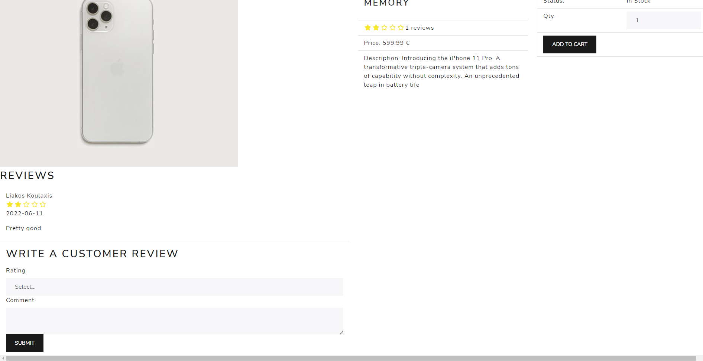

# eShop Project

# Frontend: React, Redux, Bootstrap

# Backend: Node.js, Express.js

# Database: MongoDB

# Screenshots at the very bottom

## Features

### Simple User Features

1. User Registration/Login with JWT tokens
2. Search Box
3. Latest Products - Carousel
4. Pagination
5. Profile Page  
  a. My Orders  
  b. Update Profile  
6. Product Page  
  a. Leave a review (Only 1 per User) - Comment & Rate  
  b. Reviews per product  
  c. Add to Cart based on Quantity (if It's in stock or not)  
8. Shopping Cart
9. Cart Page
10. Checkout Steps  
  a. Shipping information  
  b. Payment  
  c. Place Order  
   &ensp; I. Shipping Information  
   &ensp; II. Payment Method   
   &ensp; III. Ordered Items  
   &ensp; IV. Order Summary  

### Admin User Features

**Admin dashboard**
1. Listing all Users (Update/Delete User)
2. Listing all Products (Update/Create/Delete Product)
3. Listing all Orders

## Backend

### Middlewares
--Admin  
--User

### MongoDB Models

Order Schema

--User (Object)  
--orderItems (Array)  
  &ensp; a. name (String)  
  &ensp; b. qty (Number)  
  &ensp; c. image (String)  
  &ensp; d. price (String)  
  &ensp; e. product (Object)  
--shippingAddress (Object)  
  &ensp; a. address (String)  
  &ensp; b. city (String)  
  &ensp; c. postalCode (String)  
  &ensp; d. country (String)  
--paymentMethod (String)  
--paymentREsult (Object)  
  &ensp; a. id (String)  
  &ensp; b. status (String)  
  &ensp; c. update_time (String)  
  &ensp; d. email_address (String)  
--itemsPrice (Number)  
--taxPrice (Number)  
--shippingPrice (Number)  
--totalPrice (Number)  
--isPaid (Boolean)  
--paidAt (Date)  
--isDelivered (Boolean)  
--deliveredAt (Date)  

Product Schema

--User (Object)  
--name (String)  
--image (String)  
--brand (String)  
--category (String)  
--description (String)  
--reviews (Review Schema)  
  Review Schema  
    &ensp; a. name (String)  
    &ensp; b. rating (Number)  
    &ensp; c. comment (String)  
--rating (Number)  
--numReviews (Number)  
--price (Number)  
--countInStock (Number)  

User Schema

--name (String)  
--email (String)  
--password (String) (using bcrypt to hash)  
--isAdmin (Boolean)  

### Routes

### Orders Routes

/api/orders
  1. POST (addOrderItems) -- Make an order
  2. GET (getOrders) -- Get Orders as an Admin

/api/orders/myorders
  1. GET (getMyOrders) -- Get your orders

/api/orders/:id
  1. GET (getOrderById) -- Get order by Id

/api/orders/:id/pay
  1. PUT (updateOrderToPaid) -- Update order to paid

/api/orders/:id/deliver
  1. PUT (updateOrderToDelivered) -- Update order to Delivered

## Products Routes

/api/products
  1. GET (getAllProducts) -- Get all products
  2. POST (createProduct) -- Create a product

/api/products/top
  1. GET (getTopProducts) -- Get the top products

/api/products/:id
  1. GET (getProduct) -- Get product by Id
  2. DELETE (deleteProduct) -- Delete product by Id
  3. PUT (updateProduct) -- Update product by Id

/api/products/:id/reviews
  1. POST (createProductReview) -- Create a Product review

## Users Routes

/api/users
  1. POST (registerUser) -- Register a new user
  2. GET (getUser) -- Get a user

/api/users/login
  1. POST (loginUser) -- Login

/api/users/profile
  1. GET (getUserProfile) -- Get the profile of the user
  2. PUT (updateUserProfile) -- Update the user
 
/api/users/:id
  1. DELETE (deleteUser) -- Delete a user by Id
  2. GET (getUserById) -- Get user by Id
  3. PUT (updateUser) -- Update user by Id

## State

## Reducers

productList: productListReducer,  
productDetails: productDetailsReducer,  
productDelete: productDeleteReducer,  
productCreate: productCreateReducer,  
productUpdate: productUpdateReducer,  
productReviewCreate: productReviewCreateReducer,  
productTopRated: productTopRatedReducer,  
cart: cartReducer,  
userLogin: userLoginReducer,  
userRegister: userRegisterReducer,  
userDetails: userDetailsReducer,  
userUpdateProfile: userUpdateProfileReducer,  
userList: userListReducer,  
userDelete: userDeleteReducer,  
userUpdate: userUpdateReducer,  
orderCreate: orderCreateReducer,  
orderDetails: orderDetailsReducer,  
orderPay: orderPayReducer,  
orderListMy: orderListMyReducer,  
orderList: orderListReducer,  
orderDeliver: orderDeliverReducer,  

## Local Storage

### cartItems
Saving cart items

### userInfo
Saving user

### shippingAddress
Saving shipping information

## Screenshots

### Admin Orders

## Admin Products

## Admin Users

## Cart

## Edit Product

## Edit User

## Home

## Order not paid

## Order Paid and Delivered

## Product

## Profile

## Search

## Shipping Steps

## Sign In

## Sign Up

